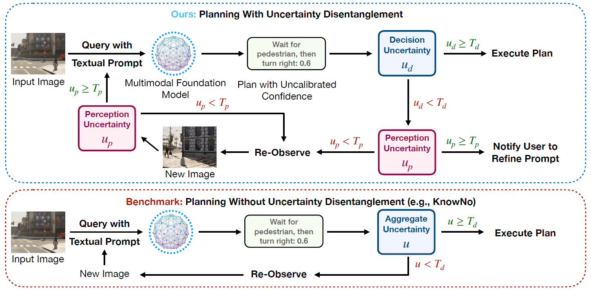

# Disentangling Perception and Decision Uncertainty for Visual Planning with Multimodal Foundation Models

We present a novel angle to deconstruct the inherent uncertainty of these models into two distinct elements: perception uncertainty associated with the visual processing capabilities of the model and decision uncertainty linked to its ability to generate actionable plans.




## Setup
```bash
$ pip install openai==1.12.0
$ pip install openai-clip==1.0.1
$ pip install seaborn
$ pip install pandas
$ pip install torch==2.2.2
$ pip install torchvision==0.17.2
```

## Instructions
1. Using conformal prediction to estimate perception uncertainty score [here](Disentangle_Uncertainty_Conformal_Prediction.ipynb).
2. Using formal-method-driven conformal prediction to estimate decision uncertainty score [here](Disentangle_Uncertainty_Conformal_Prediction.ipynb).

## Datasets
1. [Carla Images](https://drive.google.com/drive/folders/1Nqp6psvKPDkaTVC5UEfwR1N-c76qv61o?usp=sharing)
2. [Table-Top Manipulation (Robot Arm's View and Top View)](https://drive.google.com/drive/folders/1Q8oNpAawJZmGR3u9g2gmIVVpLsN7W1aM?usp=sharing)
3. [Table-Top Manipulation (Side View)](https://drive.google.com/drive/folders/17HsMV-YMzkFRAB9NQ6LoDPnEwaIiTgYV?usp=sharing)
