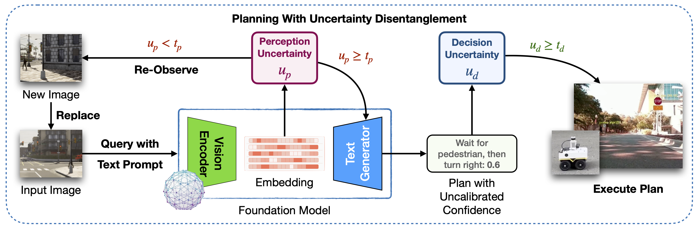

# Know Where You’re Uncertain When Planning with Multimodal Foundation Models

We presented a novel framework for enhancing multimodal foundation models in robotic planning by disentangling, quantifying, and addressing perception and decision uncertainties. By isolating perception uncertainty in visual interpretation and decision uncertainty in plan generation, our approach enables targeted uncertainty management. 




## Setup
```bash
$ pip install openai==1.40.2
$ pip install openai-clip==1.0.1
$ pip install seaborn
$ pip install pandas
$ pip install torch==2.2.2
$ pip install torchvision==0.17.2
```

## Instructions
1. Disentangle and quantify perception and decision uncertainty [here](uncertainty-quantification.ipynb).
2. Run the fine-tuned foundation model and compare with the benchmark [here](fine-tuned-model-inference.ipynb).

## Datasets
1. [Carla Images](https://drive.google.com/drive/folders/1Nqp6psvKPDkaTVC5UEfwR1N-c76qv61o?usp=sharing)
2. [Table-Top Manipulation (Robot Arm's View and Top View)](https://drive.google.com/drive/folders/1Q8oNpAawJZmGR3u9g2gmIVVpLsN7W1aM?usp=sharing)
3. [Table-Top Manipulation (Side View)](https://drive.google.com/drive/folders/17HsMV-YMzkFRAB9NQ6LoDPnEwaIiTgYV?usp=sharing)
