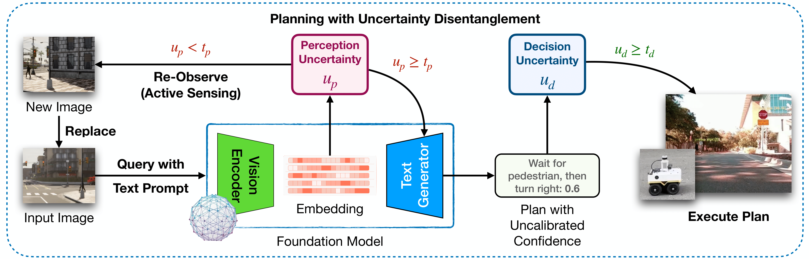

# Know Where You’re Uncertain When Planning with Multimodal Foundation Models: A Formal Framework

<p align="center">
    <a href="https://neel1302.github.io/">Neel P. Bhatt*</a>
    ·
    <a href="https://yunhaoyang234.github.io/">Yunhao Yang*</a>
    ·
    <a href="https://github.com/Rohan-Siva">Rohan Siva</a>
    <br>
    <a href="https://github.com/milan5000">Daniel Milan</a>
    .
    <a href="https://oden.utexas.edu/people/directory/ufuk--topcu/">Ufuk Topcu</a>
    .
    <a href="https://vita-group.github.io/group.html">Atlas Wang</a>
    <br>
    <em>*Equal contribution and co-first authors</em>
    <br>
    <br>
    <a href="https://uncertainty-in-planning.github.io/">Project Page</a> | <a href="https://arxiv.org/abs/2411.01639">Arxiv</a> | <a href="https://mlsys.org/virtual/2025/poster/3273">Paper</a>
</p>


## Demo Videos


**Full video** available at: [here](https://drive.google.com/file/d/1n0fD2JajoGLRwpHaHfsR9MBKnRWK4H7r/view?usp=sharing).

## Framework




We presented a novel framework for enhancing multimodal foundation models in robotic planning by disentangling, quantifying, and addressing perception and decision uncertainties. By isolating perception uncertainty in visual interpretation and decision uncertainty in plan generation, our approach enables targeted uncertainty management.

## Setup
```bash
$ pip install openai==1.40.2
$ pip install openai-clip==1.0.1
$ pip install seaborn
$ pip install pandas
$ pip install torch==2.2.2
$ pip install torchvision==0.17.2
```

## Example Notebooks
1. Disentangling and quantifying perception and decision uncertainty [here](uncertainty-quantification.ipynb).
2. Inference on our fine-tuned multimodal foundation model and comparison with benchmark [here](fine-tuned-model-inference.ipynb).

## Model Checkpoints
All model checkpoints are available on huggingface [here](https://huggingface.co/uncertainty-in-planning).

## Datasets
### Calibration
1. [Carla Images](https://drive.google.com/drive/folders/1Nqp6psvKPDkaTVC5UEfwR1N-c76qv61o?usp=sharing)
2. [Table-Top Manipulation (Robot Arm's View and Top View)](https://drive.google.com/drive/folders/1Q8oNpAawJZmGR3u9g2gmIVVpLsN7W1aM?usp=sharing)
3. [Table-Top Manipulation (Side View)](https://drive.google.com/drive/folders/17HsMV-YMzkFRAB9NQ6LoDPnEwaIiTgYV?usp=sharing)

### Training
[Carla Images](https://drive.google.com/drive/folders/1j34A-vWG0oMdAjfCZDZIaKHr4AeZ5iPU?usp=sharing)

### Testing
[Real-World Driving](https://drive.google.com/drive/folders/1Pg5c4Gp6KF7n0Oy22gaz9gXYh8TPuIBJ?usp=sharing)

### Sample Images for Inference
[Inference Samples](https://huggingface.co/datasets/uncertainty-in-planning/hf_dataset)

## Citation

If you find this work interesting and use it in your research, please consider citing our paper.
```bibtex
@inproceedings{bhatt2025knowyoureuncertainplanning,
            title={Know Where You're Uncertain When Planning with Multimodal Foundation Models: A Formal Framework},
            author={Neel P. Bhatt and Yunhao Yang and Rohan Siva and Daniel Milan and Ufuk Topcu and Zhangyang Wang},
            year={2025},
            booktitle={Proceedings of the Seventh Annual Conference on Machine Learning and Systems},
            address={Santa Clara, CA, USA},
            publisher={mlsys.org},
}
```
